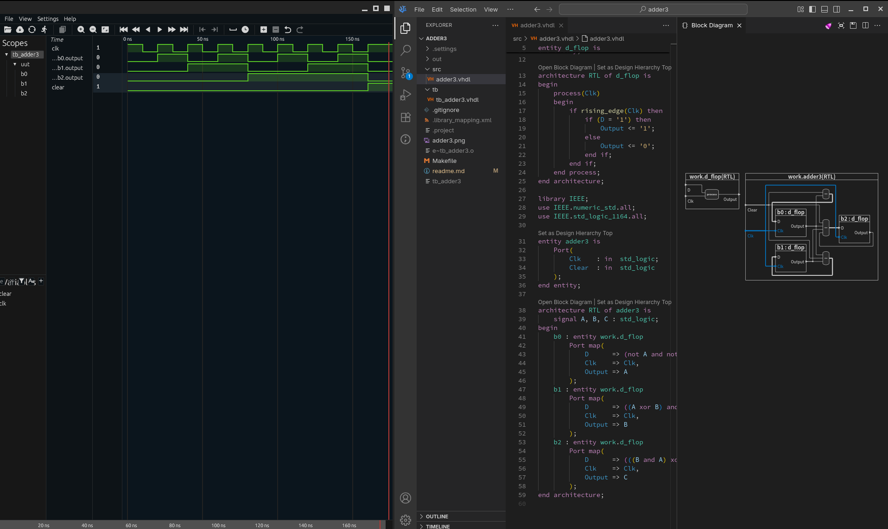

# Adder 3 

Created from the diagram on Page 77 of Blaine Readlers , 'Digital Design from Scratch Volume 1' 

 - 3 Bit addition Driven by a clock 

- Created from [vhdl_config](https://github.com/mbcarruthers/vhdl_config.git) boilerplate 